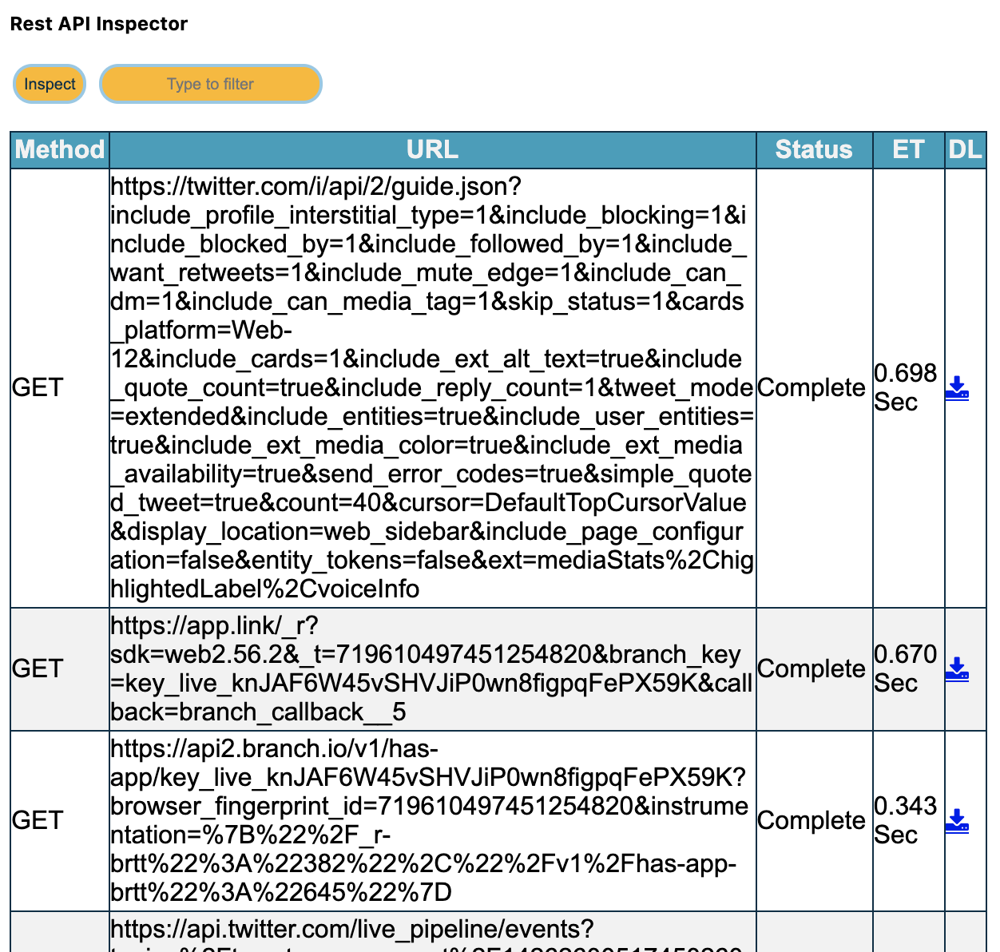
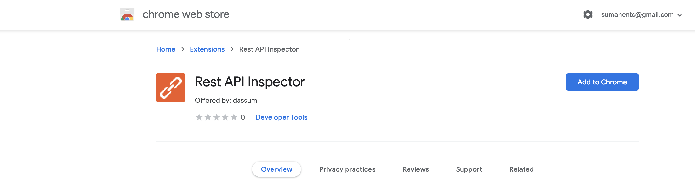
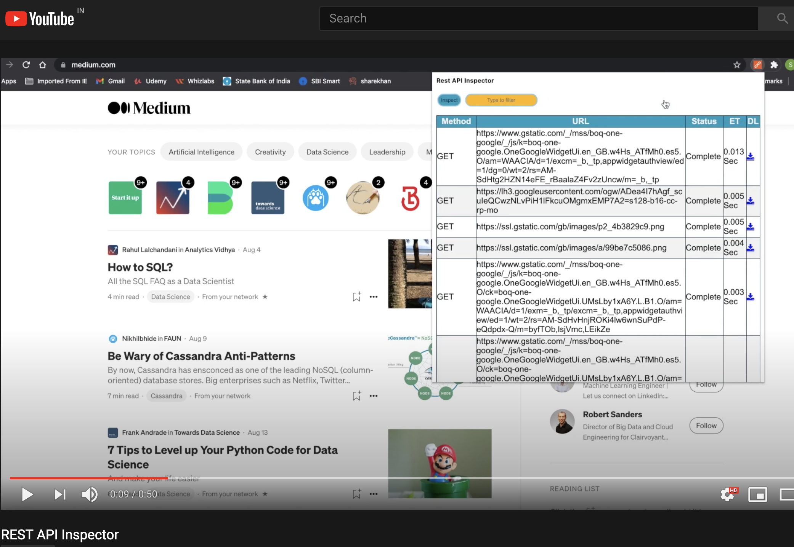

<!-- TABLE OF CONTENTS -->
<details open="open">
  <summary>Table of Contents</summary>
  <ol>
    <li>
      <a href="#about-the-project">About The Project</a>
      <ul>
        <li><a href="#built-with">Built With</a></li>
      </ul>
    </li>
    <li>
      <a href="#getting-started">Getting Started</a>
      <ul>
        <li><a href="#prerequisites">Prerequisites</a></li>
        <li><a href="#installation">Installation</a></li>
      </ul>
    </li>
    <li><a href="#usage">Usage</a></li>
    <li><a href="#license">License</a></li>
  </ol>
</details>

<!-- ABOUT THE PROJECT -->

## About The Project



REST API Inspector is a Chrome Extension, which helps you inspect all the REST API calls made by any website. Instead of using the Inspect mode of Google Chrome to manually check the REST API calls made by any website, this extension allows a ready visual access. This extension has the below features:

1. **A Ready List**: Get all the REST API calls made by any website
2. **Time Taken**: Note the time taken by each REST API call
3. **Status**: See the Pending, Complete or Error status of each REST API call
4. **API Details**: Understand the request content of the REST API call
5. **Download**: Download the REST API call content for testing or validation
6. **Search**: Have an option to search the required API from the list

### Built With

- [Chrome Extension V2](https://developer.chrome.com/docs/extensions/mv2/getstarted/)
- [JQuery](https://api.jquery.com/)
- [JavaScript](https://developer.mozilla.org/en-US/docs/Web/JavaScript)

<!-- GETTING STARTED -->

## Getting Started

[]

### Prerequisites

You should use Chrome Browser and **REST API Inspector** extension should be enabled in the browser


### Installation

Search for REST API Inspector in Chrome Web Store.


<!-- USAGE EXAMPLES -->

## Usage

You can refer to the attached clip on how to use the REST API Inspector Plugin after download.

Video demonstration (click the picture):

[](https://youtu.be/w-BY-OHYSZY)

<!-- LICENSE -->

## License

Distributed under the MIT License. See `LICENSE` for more information.

<!-- CONTACT -->

## Contact

Your Name - [@nerd_dassum](https://twitter.com/nerd_dassum) - sumanentc@gmail.com

Project Link: [Rest-API-Inspector](https://github.com/sumanentc/Rest-API-Inspector)

```

```
